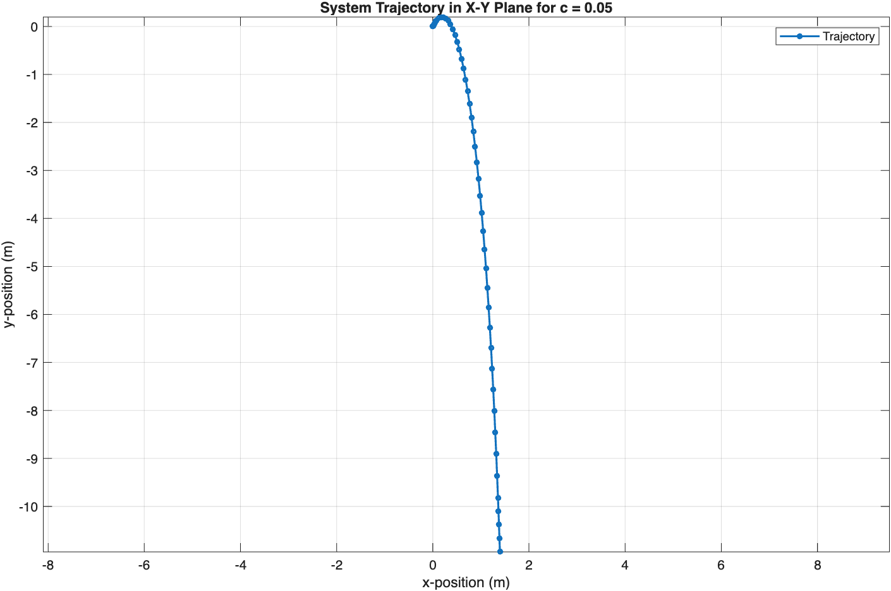
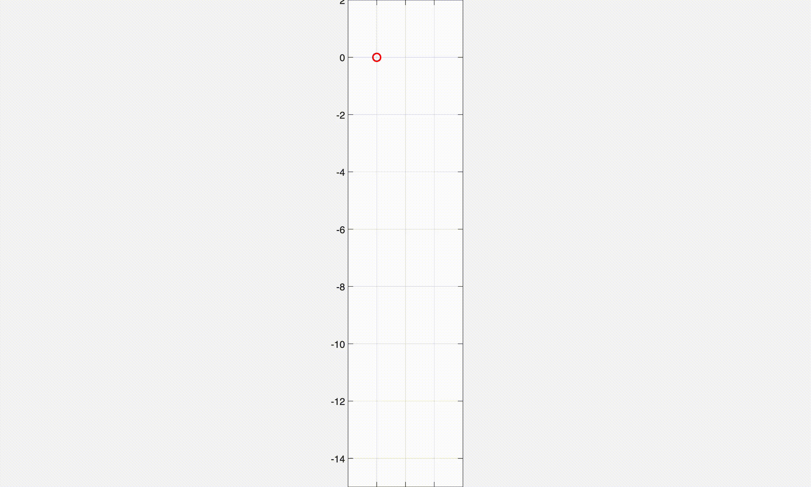
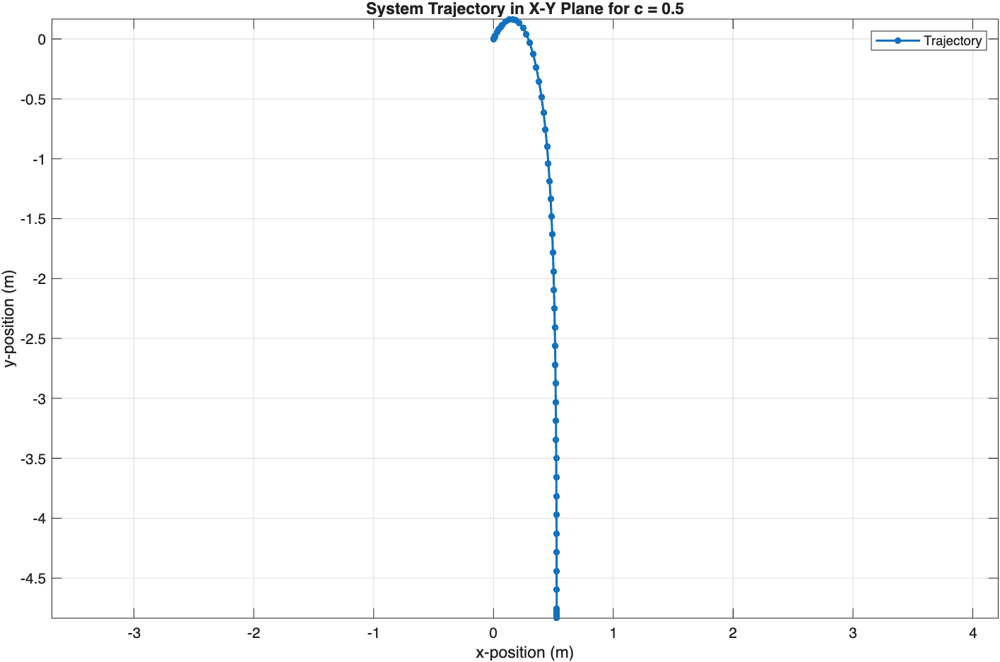
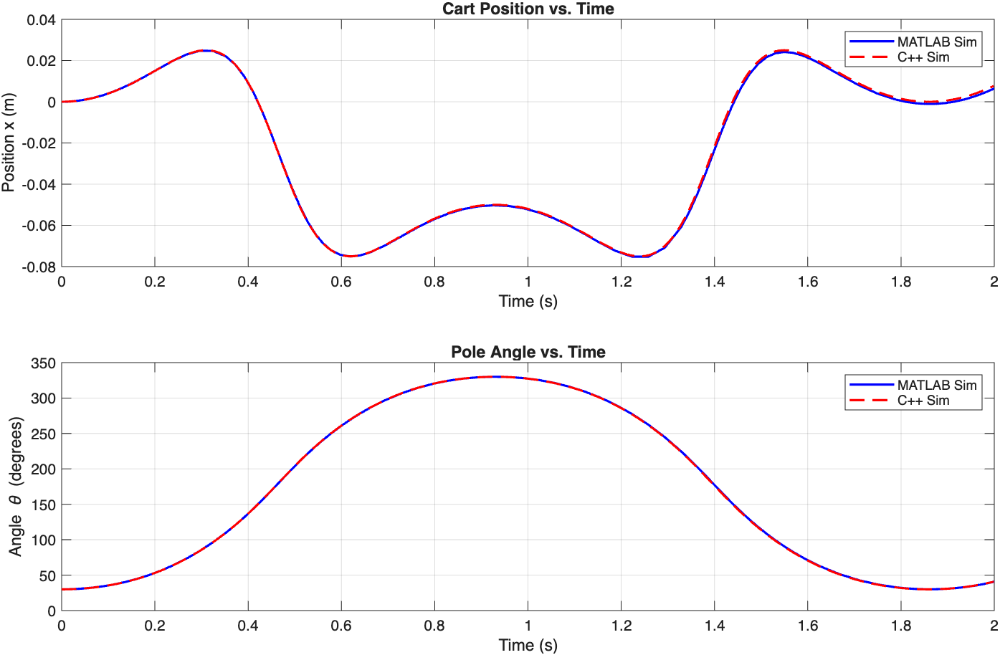
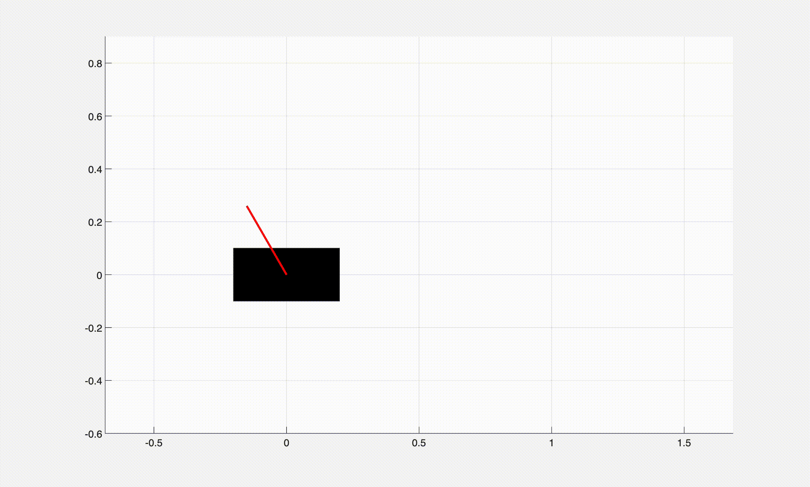
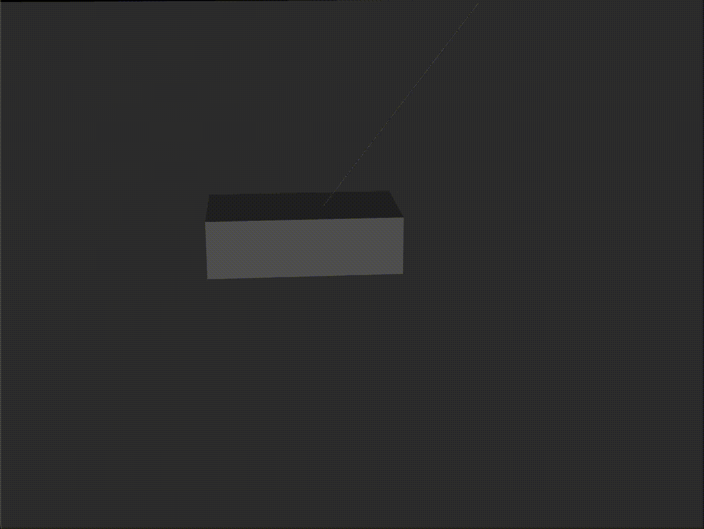
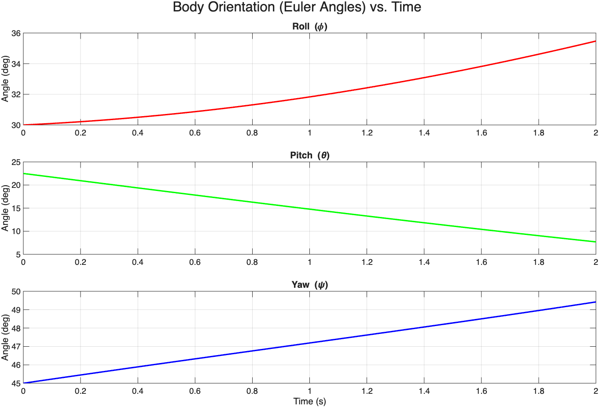
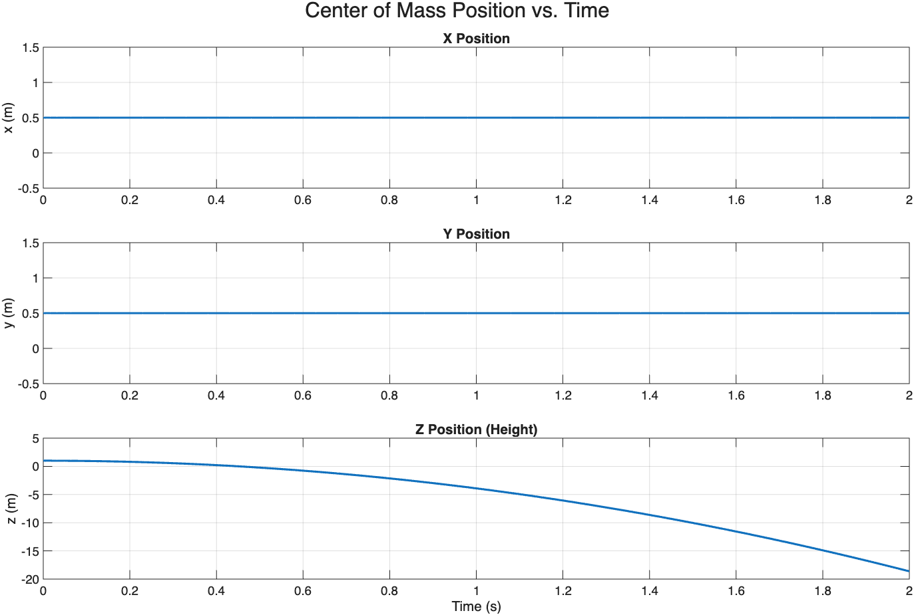
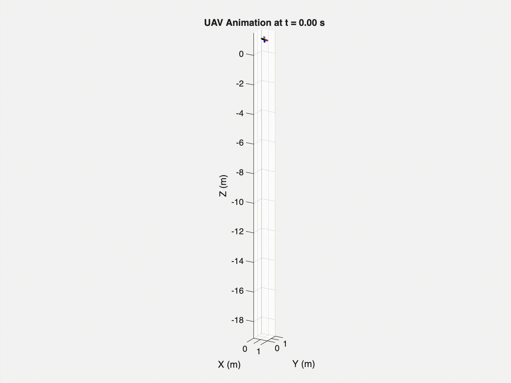

# Homework 2: Chart Results and Simulation Videos

Currently using GIFs. If they don't play automatically, please wait a few seconds or refresh the GitHub page.

---

## No1

  

  

  <em>𝑣⃗0=[1;2](𝑚/𝑠), 𝑐=0.05.</em>

  

  

  <em>𝑣⃗0=[2;1](𝑚/𝑠), 𝑐=0.05.</em>

  

  

  <em>𝑣⃗0=[1;2](𝑚/𝑠), 𝑐=0.5.</em>

---

## No2

  

  <em>x(t) & θ(t)</em>

  

  MATLAB Cart-Pole Animation

  

  MuJoCo Cart-Pole Recording

---

## No3

  

  <em>UAV Orientation EulerAngles</em>

  

  <em>UAV Position</em>

  

  UAV Simulation

