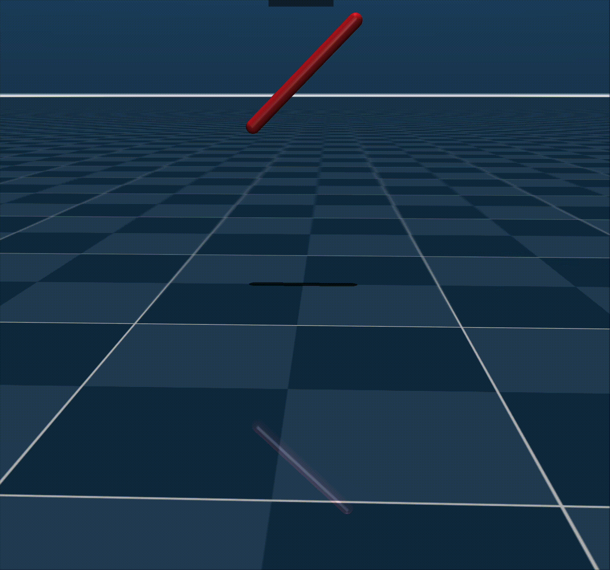
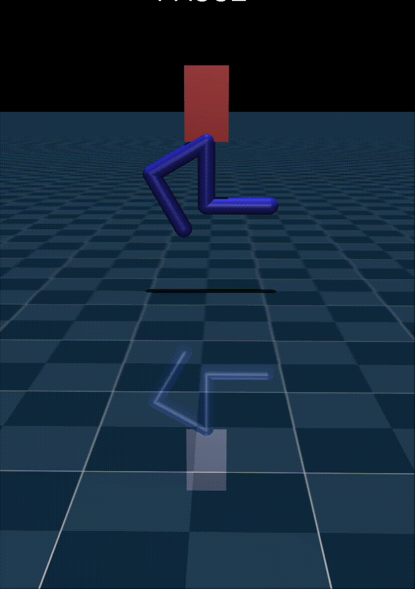
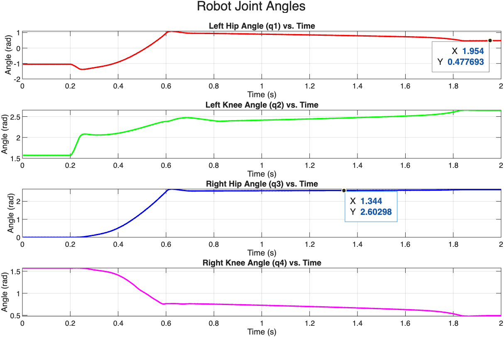
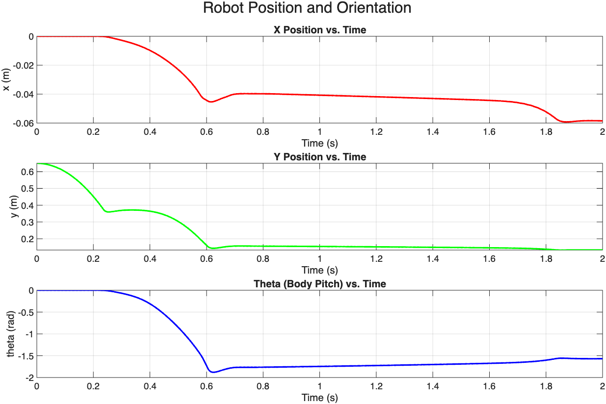
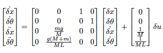
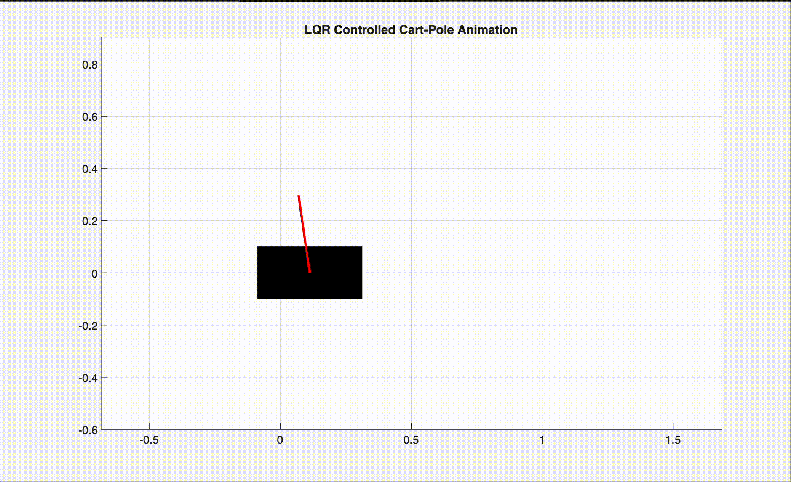

# Homework 3: Chart Results and Simulation Videos

Currently using GIFs. If they don't play automatically, please wait a few seconds or refresh the GitHub page.

---

## Problem 1: Free Falling Bar

<p align="center">
  
</p>
<p align="center">
  <em>Free Falling Bar Simulation</em>
</p>

<p align="center">
  
</p>
<p align="center">
  <em>x, z, and theta of the bar</em>
</p>

---

## Problem 2: Biped Robot

### Free Motion

<p align="center">
  
</p>
<p align="center">
  <em>Robot Free Motion Simulation</em>
</p>

<p align="center">
  
  
</p>
<p align="center">
  <em>Leg and Trunk Free Motion Plots</em>
</p>

### PD Control

<p align="center">
  
</p>
<p align="center">
  <em>Robot PD Control Simulation</em>
</p>

<p align="center">
  
  
</p>
<p align="center">
  <em>Leg and Trunk PD Control Plots</em>
</p>

---

## Problem 3: LQR Controlled Cart-Pole

### a. State Space Model

<p align="center">
  
</p>
<p align="center">
  <em>State Space Model</em>
</p>

### b. Simulation and Stability Analysis

```text
--- LQR Tuning and Rationale ---
The Q and R matrices I chose are:
Q = diag([800.0, 40.0, 0.001, 0.001])
R = 0.00001
Warning: Escaped character '\d' is not valid. See 'doc sprintf' for supported special characters. 
> In cartpole (line 127) 
Rationale: This combination heavily penalizes the angle heta (Q(2,2)=40.0) and angular velocity Rationale: This combination heavily penalizes the angle heta (Q(2,2)=0.0) and angular velocity       to quickly stabilize the pendulum and precisely control overshoot. Cart position x (Q(1,1)=800.0) is also significantly penalized,
      to ensure it returns to the origin. A very small R (R=0.00001) value is used to allow for sufficient control force,
      to achieve the fast settling time within 1.0 second.

--- Actual Performance Verification ---
>>> Actual Settling Time (5%): 0.977 s
>>> Actual Overshoot: 27.22 %

--- b.i) Proof of Local Exponential Stability ---
The closed-loop system matrix is A_cl = A - B*K. To prove local exponential stability,
we show that all eigenvalues of A_cl have negative real parts.
The calculated eigenvalues of A_cl are as follows:
 -76.7372 +72.5593i
 -76.7372 -72.5593i
  -4.8580 + 1.6112i
  -4.8580 - 1.6112i

Conclusion: All eigenvalues have negative real parts. According to Lyapunov's indirect method,
the closed-loop system is locally exponentially stable around the equilibrium point (0,0,0,0).
```

<p align="center">
  
</p>
<p align="center">
  <em>Cart-Pole LQR Control Simulation</em>
</p>

<p align="center">
  
</p>
<p align="center">
  <em>LQR Controlled Cart-Pole Response</em>
</p>
