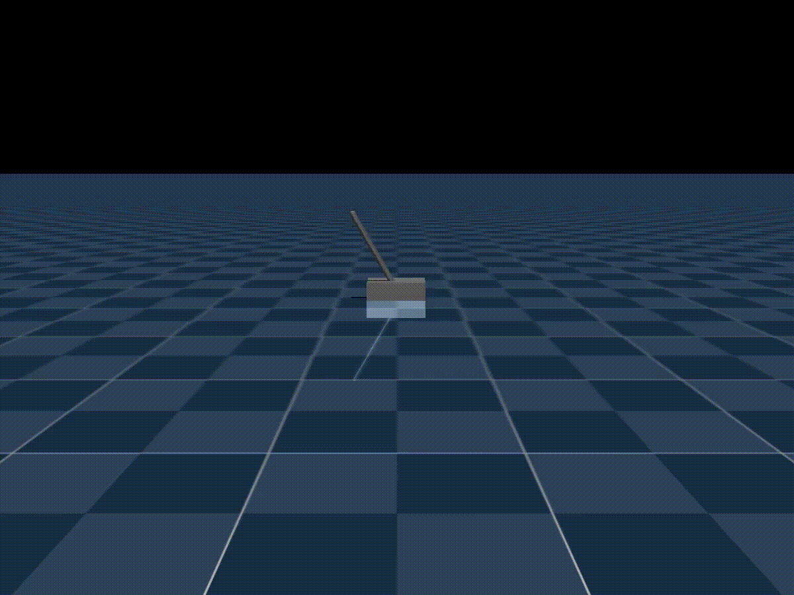
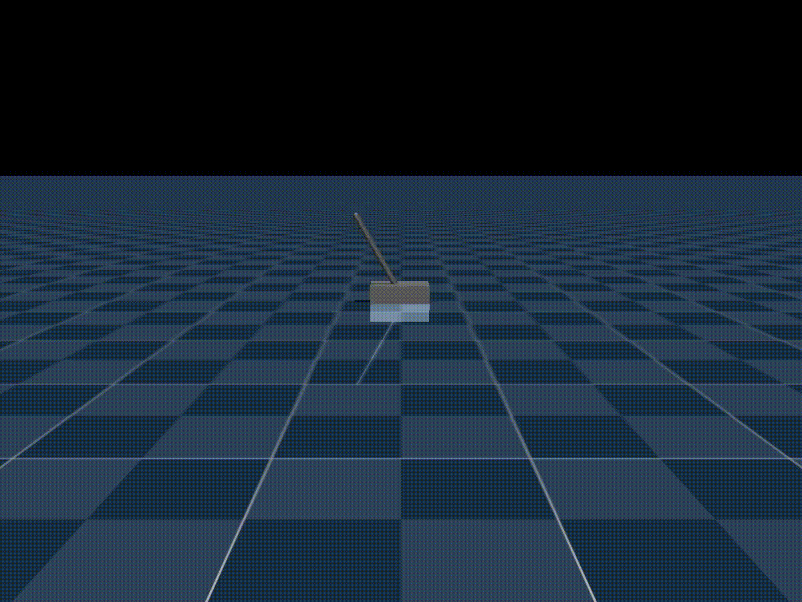
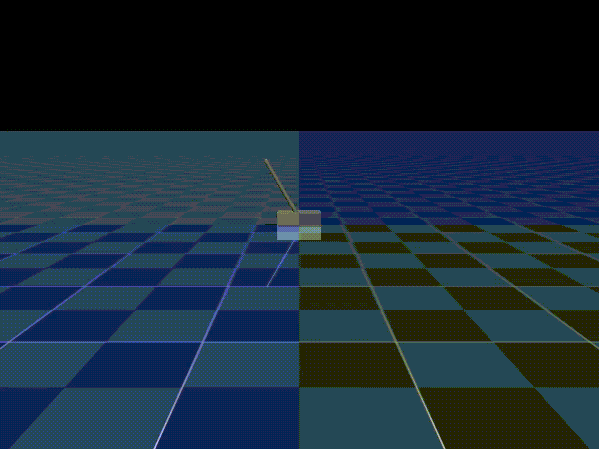
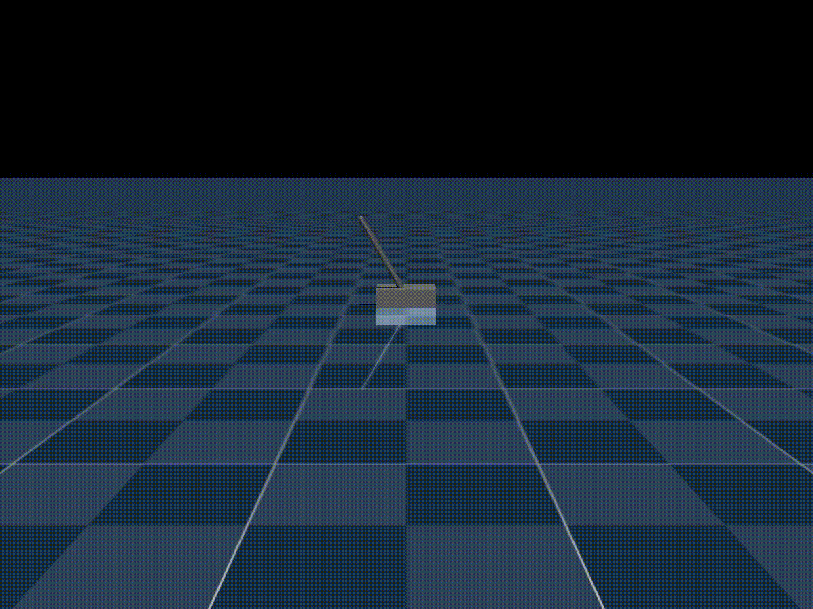
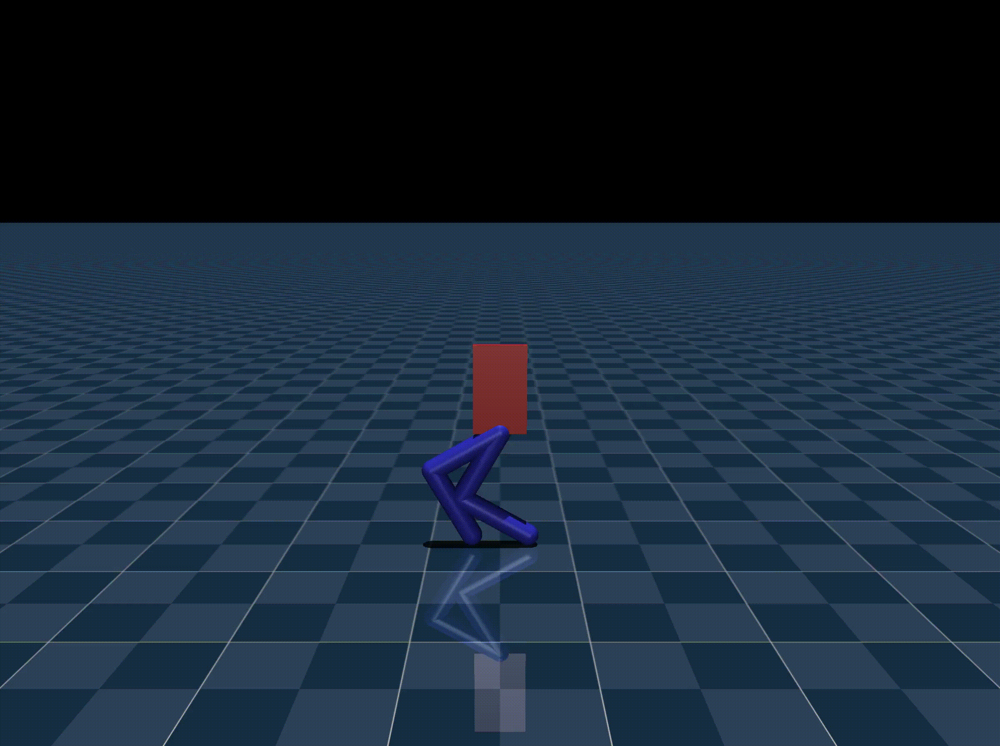
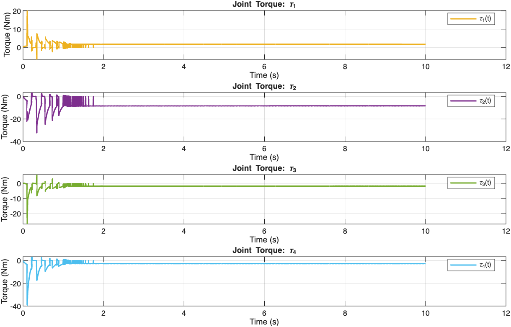

# Homework 4: Chart Results and Simulation Videos

Currently using GIFs. If they don't play automatically, please wait a few seconds or refresh the GitHub page.

---

## Problem 1: Cart-Pole Control

### a. LQR control (infinite-horizon continuous-time)

#### i) Q = diag(10, 10, 10, 10); R = 1

  

  <em>LQR Control Simulation (Case 1)</em>

  

  <em>LQR Control States (Case 1)</em>

#### ii) Q = diag(100, 0.01, 100, 0.01); R = 10

  

  <em>LQR Control Simulation (Case 2)</em>

  

  <em>LQR Control States (Case 2)</em>

#### iii) Q = diag(100, 0.01, 100, 0.01); R = 1

  

  <em>LQR Control Simulation (Case 3)</em>

  

  <em>LQR Control States (Case 3)</em>

### b. QP control

  

  <em>QP Control Simulation</em>

  

  <em>QP Control States</em>

### c. MPC control

  

  <em>MPC Control Simulation</em>

  

  <em>MPC Control States</em>

---

## Problem 2

### a. QP Control

  

  <em>Robot QP Control Simulation</em>

  

  <em>QP Control States (x, y, theta)</em>

  

  <em>QP Control Torques</em>

